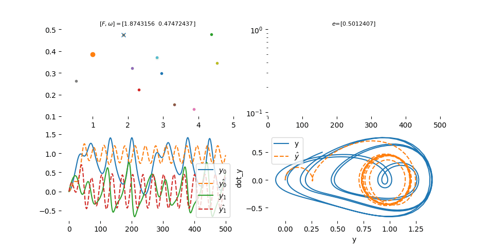

# NisI: Non-Ideal System Identification


## Overview
This repository contains the source code NisI: Non-Ideal System Identification using Particle Swarm Optimization.

## USAGE

```bash
$ make prepare-env
$ source venv/bin/activate
```
Now the environment with the nisi library is available

### Example
A Non-Ideal model is described below:
```math
\begin{align*}
\dot{x}_0 =& x_1 \\
\dot{x}_1 =& -2 \omega_n \zeta \delta(x_1)x_1 - \omega_n^2 x_0 + A\sin(2\pi\omega t)
\end{align*}

```

where: 

|model parameter| description| value|
|---|---|---|
|$$k_s$$| |unknown value|
|$$c$$ ||unknown value|
|$$m$$ |mass|1Kg|
|$$\omega$$ |Angular Frequency|0.5 rad/s|
|$$A$$ | Force Gain|4 N|

and

$`\delta(x_1)=\begin{cases}  5.0, & \text{if $|x_1|<v_1$}.\\   0.5, & \text{otherwise}.\end{cases}`$

Dynamic Non-Ideal Model is define by:

```python
class EqSystem(Model):
    def __init__(self, params=None):
        super().__init__(params)
        self._params = params

    def model(self, t, y, *args):
        def delta(vel):
            if abs(vel) > 0.1:
                d = 5.0
            else:
                d = 0.5
            return d
        k = self.unknown_const
        ks   = k[0]
        c    = k[1]
        w    = 0.5
        m    = 1
        A    = 4
        wn   = np.sqrt(ks/m)
        zeta = c/(2*m*wn)
        dy = np.zeros(len(self.x0),)
        dy[0] = y[1]
        dy[1] = -2 * zeta * wn * delta(y[1])*y[1] - wn ** 2 * y[0] + A*np.sin(2*np.pi*w*t)
        return dy
```
next the parameter configurations need to provide:
```python
params = {'optmizer': {'lowBound': [1.0 , 1.0],
                        'upBound': [8,  8],
                        'maxVelocity':  2, 
                        'minVelocity': -2,
                        'nPop': 10,
                        'nVar': 2,
                        'social_weight': 2.0,
                        'cognitive_weight': 1.0,
                        'w': 0.9,
                        'beta': 0.1,
                        'w_damping': 0.999},
            'dyn_system': {'model_path': '',
                            'external': None,
                            'state_mask' : [True, False],
                            'loss': 'mse',
                            'x0': [0., 0.],
                            't': [0,6,1000]
                            }
            }
```
Note, only one state was observed of system.
So, to run this example, please follow the steps above:

```bash
$(venv)$ python ./examples/two_unknown_variables_one_state_observed.py
```

### Expected Result


final output:

```python
i: 99, e: [0.00041643], predict: [2.54475561 5.10002245]
```



final output:

```python
i: 99, e: [2.06116586e-06], predict: [1.00015914 0.38508506]
```


## Social

* <sub><sub>[](https://discord.gg/c4yWGHcAeM)</sub></sub>

# References
* [PSO Method for WhiteBox Identification System](https://gitlab.com/jeferson.lima/wbident)

# Bugs & Feature Requests
Please report bugs and request features using the [issues](https://gitlab.com/jeferson.lima/nisi/-/issues)
