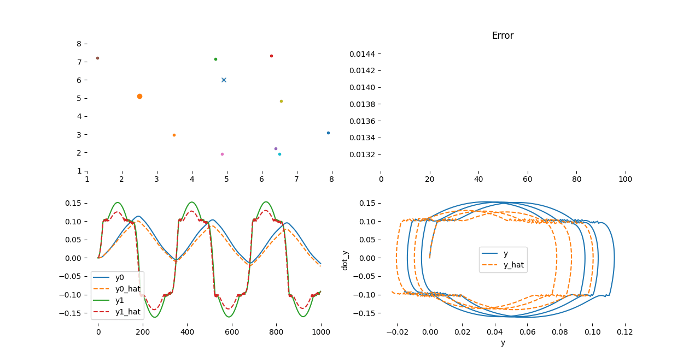

# NisI: Non-Ideal System Identification


## Overview
This repository contains the source code [NisI](https://gitlab.com/jeferson.lima/nisi): Non-Ideal System Identification using Particle Swarm Optimization (PSO) for the identification of systems with high parametric sensitivity in regions of chaotic operation.

In experimental studies of non-ideal dynamic models, typically due to physical or sensor limitations, only one state of the system is observed. In this context, NisI can perform the parametric identification of N unknown variables. The algorithm operates with each PSO particle acting as a fourth-order Runge-Kutta integrator, seeking the best approximation of the simulated model to the experimental data.

## USAGE

[NisI](https://gitlab.com/jeferson.lima/nisi) provides an installation script to simplify its installation and usage. Some prerequisites are essential before preparing the environment.

### Requirements
* [make](https://www.gnu.org/software/make/)
* [python](https://www.python.org/downloads/)

Next, the script setting up the environment can be utilized.

```bash
$ make prepare-env
$ source venv/bin/activate
```
Now the environment with the nisi library is available. An example can be executed using the generic command provided below:

```bash 
(venv)$ python examples/$(DYN_SYS_EXAMPLE)
```

> Please replace the name `$(DYN_SYS_EXAMPLE)` with one of the examples or with a new script written by the user."

### Examples
To demonstrate the parametric identification of a system in a chaotic regime, we will present the dynamic system of the Duffing oscillator.

So, the Non-Ideal model is described below:

```math
\begin{align*}
\dot{x}_0 =& x_1 \\
\dot{x}_1 =& -\alpha x_1 -\delta x_0 - \beta x_0^3 + F\cos(x_2 + a_0\sin[b_0x_2 + c_0]) \\
\dot{x}_2 =& \omega
\end{align*}
```

where: 

|model parameter| value|
|---|---|
|$$a_0$$|non-ideal term|
|$$b_0$$|non-ideal term|
|$$\alpha$$ | 0.5|
|$$\beta$$  | 1.0|
|$$\delta$$ | -1.0|
|$$\omega$$ |unknown value|
|$$F$$ | unknown value|

Dynamic Non-Ideal Model is define by the `EqSystem` class:

```python
class EqSystem(Model):
    def __init__(self, params=None):
        super().__init__(params)
        self._params = params

    def model(self, t, x, *args):
        k = self.unknown_const
        alpha = 0.5
        beta  = 1
        delta = -1
        omega = k[0]
        F     = k[1]

        dx = np.zeros(len(self.x0),)
        dx[0] = x[1]
        dy[1] = -alpha*y[1] -delta*y[0] -beta*y[0]**3 + F*np.cos(y[2] + a_0*np.sin(b_0*y[2]+c_0))
        dx[2] = omega
        return dx
```

Next the parameter configurations need to provide:

```python
params = {'optmizer': {'lowBound': [0.1 , 0.1],
                        'upBound': [5.0,  0.5],
                        'maxVelocity':  2, 
                        'minVelocity': -2,
                        'nPop': 10,
                        'nVar': 2,
                        'social_weight': 2.0,
                        'cognitive_weight': 1.0,
                        'w': 0.9,
                        'beta': 0.1,
                        'w_damping': 0.999,
                        'escape_min_vel_percent': 0.0005,
                       'escape_min_error': 2e-3},
            'dyn_system': {'model_path': '',
                            'external': None,
                            'state_mask' : [True, False, False],
                           'loss': 'rmse',
                            'x0': [0., 0., 0.],
                            't': [0,50,500]
                            }
            }
```

Note, only one state was observed of system:
```python
#            x_0    x_1    x_2
state_mask: [True,  False, False]
```
So, to run this example, please follow the steps above:

```bash
$(venv)$ python ./examples/duffing_oscilator_two_unknown_variables_one_state_observed.py
```

### Expected Result



The simulation of the experimental system has the parameters $\omega = 1.0$ and $F = 0.385$. The algorithm found the parameters with a significantly small error as shown below

```python
e: [8.7e-06], predict: [100000017 0.38499979]
```

> An `modified_oscillator` model has been added to the `examples/` folder.


## Citation
Please cite [our work](https://www.techrxiv.org/doi/full/10.36227/techrxiv.170630655.56990506/v2) if you use it.

```
@article{Lima2024,
  title = {NisI: A Tool for Non-Ideal System Identification},
  DOI = {10.36227/techrxiv.170630655.56990506/v1},
  publisher = {Institute of Electrical and Electronics Engineers (IEEE)},
  author = {Lima,  Jeferson José de and Kaster,  Mauricio S and Martins,  Marcella S R and Ribeiro,  Mauricio A and Tusset,  Angelo M and Balthazar,  José M},
  year = {2024},
  month = jan 
}
```


## Social

* <sub><sub>[](https://discord.gg/c4yWGHcAeM)</sub></sub>

# References

# Bugs & Feature Requests
Please report bugs and request features using the [issues](https://gitlab.com/jeferson.lima/nisi/-/issues)
